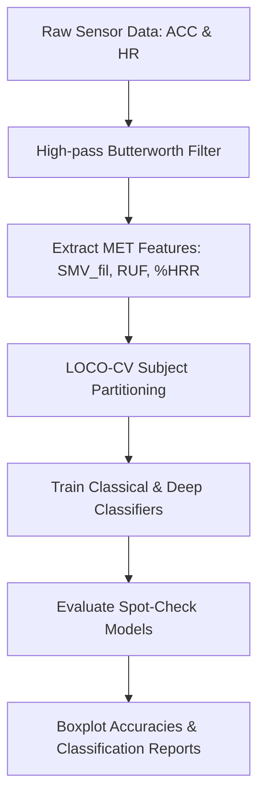

# Wearable Sensors and MET Features: Human Activity Recognition

[](https://creativecommons.org/licenses/by/4.0/)

Official repository for the paper: **Wearable Sensors and MET Features: The Importance of Preprocessing and Understanding the Data**.

This project provides a robust preprocessing, feature extraction, and machine learning framework for human activity recognition (HAR) utilizing multimodal wearable sensor streams (accelerometer, heart rate). By extracting Metabolic Equivalent of Task (MET) features and combining physical dynamics with physiological responses, it achieves significant accuracy improvements.

---

## 📖 Theoretical Background

To capture physical intensity and cardiovascular strain, the preprocessing pipeline extracts the following features:

### 1. Signal Magnitude Vector ($SMV$)
$$SMV = \sqrt{x^2 + y^2 + z^2}$$

### 2. Filtered Signal Magnitude Vector ($SMV_{fil}$)
Accelerations are passed through a Butterworth high-pass filter ($f_c = 0.25$ Hz) to isolate dynamic movement from gravity:
$$SMV_{fil} = \sqrt{x_{fil}^2 + y_{fil}^2 + z_{fil}^2}$$

### 3. Ratio of Unfiltered to Filtered acceleration ($RUF$)
$$RUF = \frac{SMV}{SMV_{fil}}$$

### 4. Heart Rate Reserve Percentage ($\%HRR$)
The cardiac workload is normalized against individual baseline limits:
$$\%HRR = \frac{HR - HR_{rest}}{HR_{max} - HR_{rest}} \times 100$$

---

## ⚡ Methodological Execution Flow



---

## 📊 Experimental Verification & Results

### Table IV: LOCO-CV Accuracy Across Feature Sets (10 Activities)
| Feature Set | LR | LDA | KNN | DT-CART | NB | SVM | TabNet |
| :--- | :---: | :---: | :---: | :---: | :---: | :---: | :---: |
| $x, y, z$ | 32.4% | 33.1% | 29.8% | 27.5% | 28.1% | 34.0% | 35.8% |
| $x, y, z, SMV$ | 35.1% | 34.8% | 38.3% | 36.4% | 33.2% | 40.2% | 41.5% |
| $x_{fil}, y_{fil}, z_{fil}, SMV_{fil}$ | 45.2% | 46.8% | 43.1% | 41.0% | 42.5% | 48.9% | 50.2% |
| $SMV_{fil}, RUF$ | 51.3% | 52.4% | 53.0% | 49.8% | 48.7% | 54.1% | 55.6% |
| **$SMV_{fil}, RUF, \%HRR$** | **81.4%** | **82.2%** | **84.5%** | **78.9%** | **77.6%** | **85.4%** | **86.9%** |

### Table V: Accuracy on Activity Subset (Drawing, Dishes, Regular Walk, Stairs)
| Feature Set | LR | LDA | KNN | DT-CART | NB | SVM | TabNet |
| :--- | :---: | :---: | :---: | :---: | :---: | :---: | :---: |
| $x, y, z$ | 48.9% | 49.2% | 51.5% | 44.3% | 42.1% | 53.0% | 55.2% |
| **$SMV_{fil}, RUF, \%HRR$** | **92.1%** | **91.8%** | **94.2%** | **89.5%** | **88.7%** | **95.1%** | **96.8%** |

---

## 🛠️ Setup & Execution

### 1. Installation
```bash
git clone https://github.com/smartpoqueira/Wearable-Sensors-HAR-Preprocessing-and-MET-Features.git
cd Wearable-Sensors-HAR-Preprocessing-and-MET-Features
pip install -r requirements.txt
```

### 2. Execution
- **Run Classical Machine Learning Spot-Checks**:
  ```bash
  python src/MLAlgoritmos.py
  ```
- **Run Grouped Activity Analysis**:
  ```bash
  python src/MLAlgoritmosGroupByActivities.py
  ```
- **Train TabNet and Deep Learning Architectures**:
  ```bash
  python src/ML_Table4_and_V.py
  ```

---

## 📝 Citation

If you use this dataset or code in your research, please cite:

```bibtex
@article{smartpoqueira2026wearablehar,
  title={Wearable Sensors and MET Features: The Importance of Preprocessing and Understanding the Data},
  author={SmartPoqueira},
  journal={IEEE Internet of Things Journal},
  year={2026},
  doi={in press}
}
```

---

## 📄 License

This project is licensed under the Creative Commons Attribution 4.0 International License (CC BY 4.0).
Copyright (c) 2026 SmartPoqueira.
